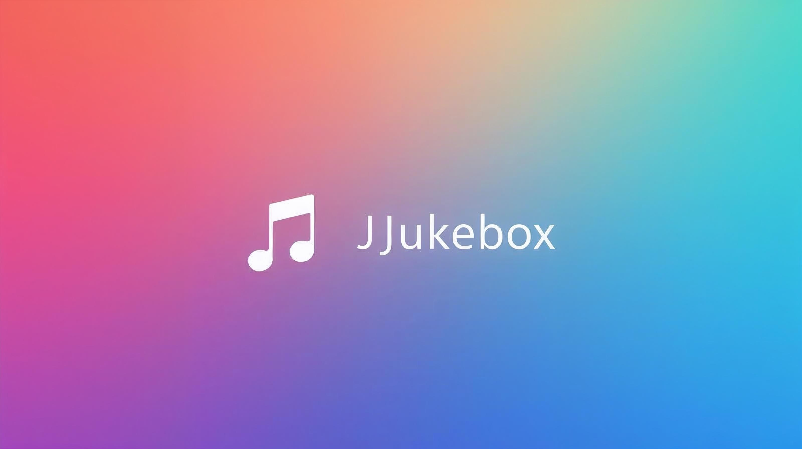

# Java Audio Player

### Built with the tools and technologies

This project implements a simple audio player using Java, with support for multiple audio file formats, including MP3, WAV, and OGG. It includes a fully functional graphical user interface (GUI) built with JavaFX, allowing users to play, pause, stop, and skip through songs in a playlist.

## Features

- **Audio File Support**: Supports various audio file formats such as `.wav`, `.mp3`, and `.ogg`.
- **Playlist Management**: Users can create and load playlists from `.m3u` files, add or remove songs, and save playlists to files.
- **Search and Sort**: The playlist can be filtered by author, title, album, and duration.
- **Play/Pause/Stop Controls**: The user can control the playback of audio files.
- **Duration Display**: Shows the current playtime and total duration of each audio file.
- **User Interface**: JavaFX-based GUI with intuitive controls for managing playback and playlist.

## Structure

The project consists of several components that work together to provide audio playback and playlist management:

### Audio File Handling

- **AudioFile**: Abstract class representing audio files with methods for playback, pausing, and stopping.
- **SampledFile**: A subclass of `AudioFile` representing audio files with a duration (e.g., `.mp3` and `.wav`).
- **TaggedFile**: A subclass of `SampledFile` that supports audio files with metadata like title, artist, and album.
- **WavFile**: A subclass of `SampledFile` for handling `.wav` files.
- **NotPlayableException**: Custom exception thrown when an audio file cannot be played.

### Playlist Management

- **PlayList**: Manages a collection of `AudioFile` objects. Supports adding, removing, and iterating through the list.
- **ControllablePlayListIterator**: An iterator for navigating through the playlist with search and sort functionality.
- **AudioFileFactory**: Factory class to create `AudioFile` objects based on the file extension.

### Sorting and Comparison

The playlist can be sorted by various criteria using comparator classes:
- **AlbumComparator**: Compares `AudioFile` objects by their album.
- **AuthorComparator**: Compares `AudioFile` objects by their author (artist).
- **DurationComparator**: Compares `AudioFile` objects by their duration.
- **TitleComparator**: Compares `AudioFile` objects by their title.

### UI Components

- **Song**: A model for representing each song with properties like artist, title, album, and duration.
- **SongTable**: A table view that displays the playlist and allows row selection for playback.
- **Player**: The main class for the JavaFX application, responsible for controlling the playback and managing the UI.

## Requirements

- Java 8 or higher
- JavaFX library

## Running the Project

1. Clone this repository to your local machine.
2. Compile and run the `Player` class. It will launch the JavaFX-based audio player UI.
3. You can open existing `.m3u` playlist files, or create your own playlist by adding audio files to the list.

## Example Usage

- **Loading a Playlist**: When the application starts, you can load a playlist by selecting a `.m3u` file.
- **Search**: Filter the playlist by title, artist, or album using the search field.
- **Sort**: Sort the playlist by author, title, album, or duration using the sort dropdown menu.
- **Control Playback**: Use the play, pause, stop, and next buttons to control the audio playback.

## Project Dependencies

- JavaFX: For building the graphical user interface.
- BasicPlayer: For handling the actual playback of audio files (e.g., through an external library for MP3 and WAV decoding).
